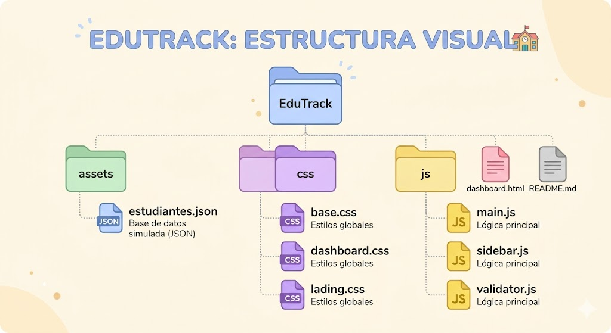

# EduTrack 🎓

EduTrack es una plataforma web e interfaz interactiva diseñada para optimizar la gestión escolar en entornos educativos (EdTech). La aplicación centraliza el control de estudiantes, personal docente, asistencia y el estado de pagos en un panel de administración responsivo y fácil de usar.

---

## 🔥 Características Principales

*   **Panel de Administración (Dashboard):** Visualización de estadísticas clave en tiempo real (total de estudiantes, profesores activos, clases y métricas de recaudación).
*   **Gestión de Estudiantes y Docentes (CRUD):** Control total para registrar, editar, visualizar y dar de baja usuarios del sistema de forma organizada.
*   **Monitoreo de Asistencia:** Sistema digital para registrar la asistencia diaria por clases, reduciendo el uso de papel.
*   **Control de Inventario y Cuotas:** Módulo financiero integrado para supervisar el estado de pagos mensuales por estudiante (Pagado / Pendiente).
*   **Diseño Totalmente Responsivo:** Interfaz adaptada para una navegación fluida tanto en computadoras de escritorio como en dispositivos móviles.

---

## 🛠️ Tecnologías Utilizadas

*   **Front-End:** HTML5, CSS3 (Flexbox/Grid para layouts limpios y modernos), JavaScript (ES6+).
*   **Persistencia / Backend (Opcional si aplica):** Sincronización en tiempo real mediante base de datos y autenticación segura.
*   **Herramientas:** Git para el control de versiones y Visual Studio Code como entorno de desarrollo principal.

---

## 📦 Estructura Visual

# 👤 Autor
Jose Luis Herrera 